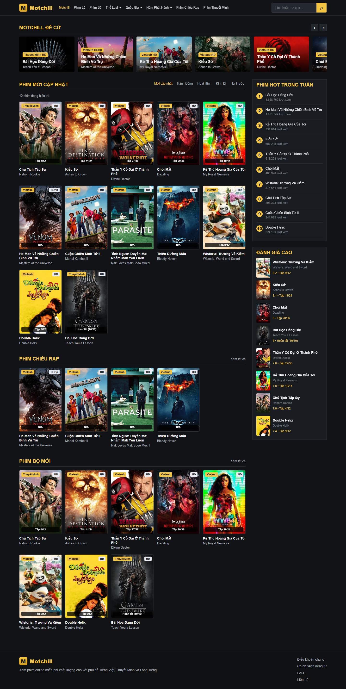
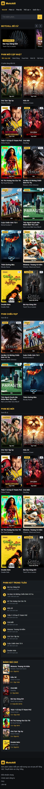

# VibePhim - Movie Streaming Platform Clone

A modern, responsive movie streaming platform built with vanilla HTML, CSS, and JavaScript. Features a sleek design with gradient effects, smooth animations, and integrated TMDB API for real movie data.




## ✨ Features

- **Beautiful UI Design** - Modern dark theme with gradient effects and smooth animations
- **Responsive Layout** - Works seamlessly on desktop, tablet, and mobile devices
- **Movie Database Integration** - Real movie data from TMDB API
- **Advanced Header** - Animated gradient header with glow effects and search functionality
- **Movie Grid** - Dynamic movie grid with hover effects and smooth transitions
- **Modal Details** - Movie information popup with backdrop and poster images
- **User Authentication** - Mock authentication system with localStorage persistence
- **Genre & Country Filters** - Browse movies by categories
- **Search Functionality** - Search movies in real-time
- **Hot Ranking** - Trending movies section
- **Smooth Animations** - CSS transitions and keyframe animations throughout

## 🚀 Quick Start

### Prerequisites
- Modern web browser (Chrome, Firefox, Safari, Edge)
- Internet connection (for TMDB API)

### Installation

1. **Clone the repository**
```bash
git clone https://github.com/dzdang1000-collab/web_phim.git
cd web_phim
```

2. **Open in browser**
- Simply open `index.html` in your web browser
- No build process or dependencies required!

```bash
# On Windows
start index.html

# On Mac
open index.html

# On Linux
xdg-open index.html
```

Or use a local server:
```bash
# Using Python 3
python -m http.server 8000

# Using Python 2
python -m SimpleHTTPServer 8000

# Using Node.js http-server
npx http-server
```

Then visit: `http://localhost:8000`

## 📁 Project Structure

```
web_phim/
├── index.html          # Main HTML file
├── styles.css          # All styling with modern effects
├── script.js           # JavaScript functionality
├── data.js             # TMDB API configuration
├── README.md           # This file
└── images/             # Demo screenshots
```

## 🎨 Key Features Explained

### Header Design
- Gradient background with animated glow effect
- Search bar with focus effects
- Navigation with underline animations
- Responsive menu on mobile

### Movie Grid
- 5-column grid layout on desktop
- Smooth hover effects with zoom and brightness
- Play button overlay on hover
- Movie badges (rating, episode count)

### Modal System
- Click any movie to view details
- Beautiful backdrop image
- Movie poster and information
- Watch and trailer buttons

### Authentication
- Mock login/signup system
- Username stored in localStorage
- User menu with logout option

## 🛠️ Customization

### Change Colors
Edit the CSS variables in `styles.css`:
```css
:root {
    --accent: #f4c542;        /* Yellow accent */
    --accent-2: #d49b18;      /* Dark yellow */
    --bg: #111316;            /* Background */
    --text: #f4f4f4;          /* Text color */
}
```

### Update TMDB API
Edit `data.js`:
```javascript
const TMDB_API_KEY = 'your-api-key';
const BASE_URL = 'https://api.themoviedb.org/3';
```

Get your free API key at: https://www.themoviedb.org/settings/api

## 📱 Responsive Design

- **Desktop** (1041px+): Full layout with sidebar
- **Tablet** (761px - 1040px): Single column with grid sidebar
- **Mobile** (<760px): Optimized mobile experience
- **Small Mobile** (<460px): 2-column grid layout

## 🎯 Usage

1. **Browse Movies** - Scroll through various movie categories
2. **Search** - Use the search bar to find specific movies
3. **Filter** - Click navigation items to filter by genre/country/year
4. **View Details** - Click on any movie card to see full information
5. **Login** - Click "Đăng nhập" to create a mock account

## 🌟 Animations & Effects

- Smooth gradient backgrounds
- Header glow animations
- Navigation underline effects
- Search bar focus glow
- Movie card hover zoom
- Button shine effects
- Modal transitions

## 🔧 Browser Support

- Chrome/Chromium (Latest)
- Firefox (Latest)
- Safari (Latest)
- Edge (Latest)

## 📝 Notes

- This is a clone/demo project using TMDB API
- No actual streaming functionality
- Educational purposes only

## 🤝 Contributing

Feel free to fork, modify, and improve!

## 📄 License

This project is open source and available under the MIT License.

---

**Made with ❤️ by the development team**

For more information visit: [TMDB API Documentation](https://developers.themoviedb.org/3)